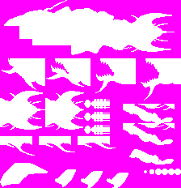

# How to make resources

**Since we cannot release the resources due to rights issues,**  
we will provide information on how to make your own.  
<ins>**We do not accept questions about resources, please be patient.**</ins>

## Overview
Resources required in the game are loaded from the SD card (exclude font source file).  
Please place each resource in the designated location.

## Bitmap font entity source file
The df88_font entity must be prepared.  
Source will comile and put to PROGMEM.

see also df88.hpp  
```
extern const ::lgfx::GFXfont df88_gfx_font;
```

### Filename
Source : df88.cpp  
Put source to ./src

### Font source image
ASCII CODE from 0x20 to 0x5F  
```
 '"#$%&'()*+,-./0123456789:;<=>?©ABCDEFGHIJKLMNOPQRSTUVWXYZ[\]^_
```
### Remarks
You can use [make_lgfxbmpfont.py](https://github.com/GOB52/bitmap_tools) to make source file from bitmap.

### e.g.

```C++
#include <pgmspace.h>
#include <cstddef>
#include <cstdint>
#include "df88.hpp"

static const std::uint8_t df88_bitmaps[] PROGMEM =
{
    0x00,0x00,0x00,0x00,0x00,0x00,0x00,0x00,	// ' '
    0x1c,......
	.
	.
	.
	
};
static const lgfx::GFXglyph df88_glyphs[] PROGMEM =
{
    { 0, 8, 8, 8, 0, -8 },	//' '
    { 8, 8, 8, 8, 0, -8 },	//'!'
	.
	.
	.
};

const lgfx::GFXfont df88_font PROGMEM =
{
    (std::uint8_t*)df88_bitmaps,
    (lgfx::GFXglyph*)df88_glyphs,
    0x20, // ' '
    0x5f, // '_'
    8,
};
```

## Graphics resources

### Format 
Windows bitmap(v3) 4bit depth 16 colors.  
Palette index 0 is transparent palette, so you can set 15 colors freely each bitmaps.

### Location
/res/td/

### Remarks
You can use [reorder_palette.py](https://github.com/GOB52/bitmap_tools) to sort the bitmap palette colors.

### Elements

#### Advertise
##### Logo
Filename: "logo.bmp"  
Width: 224 Height: 64  


#### Character
##### My ship
Player ship and bullet.  
Filename: "sh.bmp"  
Width: 88 Height: 32  


##### Enemy
Mine, Yazuka, and Crash  
Filename: "enemy.bmp"  
Width: 96 Height: 48  


#### Background
##### Wave and spot
Filename: "bg0.bmp"  
Width: 64 Height: 160  
Wave cloud patern that horizontal direction must be connected bg0 anf bg1.  
No transparent.  
Those palette colors must exists in bitmap for animate palette.  
 `RGB(48,96,64)`
 `RGB(72,160,104)`
 `RGB(112,224,144)`


Filename: "bg1.bmp"  
Width: 96 Height: 160  
Great spot patern that horizontal direction must be connected bg0 and bg1.  
No transparent.  
Those palette colors must exists in bitmap for animate palette.  
 `RGB(48,96,64)`
 `RGB(72,160,104)`
 `RGB(112,224,144)`


##### Rock surface
Upper/lower rock surfaces.  
Filename: "rock.bmp"  
Width: 320 Height: 16  
Rock surface that that horizontal direction must be connected.  
No transparent.  


##### Branch rock
Using when choose next stage.  
Filename: "branch.bmp"  
Width: 160 Height: 16  
Branch rock that that horizontal direction must be connected.  


#### Information
##### Frame for zone,remaining
For information.
Filename: "zone.bmp"  
Width: 80 Height: 40  
No transparent.  


#### Effect
##### Explosion
Filename: "bomb.bmp"  
Width: 256 Height: 64  


#### Boss
##### Coelacanth
Body,parts and bullet.  
Filename: "kf.bmp"  
Width: 224 Height: 232  
Those palette colors must exists in bitmap.   
Palette of colors will be grayscaled when the boss appears, leaves, and escapes.  
 `RGB(0,24,90)`
 `RGB(0,90,189)`
 `RGB(0,41,123)`




## Sound resources

### Format 
Wave file format, linear PCM, 8bit mono  

### Location

/res/td/wav/

### BGM

|Title|Filename|
|:---|:---|
|Insert coin|IC.wav|
|Insert coin B|ICB.wav|
|Stage A,etc|CN.wav|
|Stage F,etc|CMT.wav|
|Stage C, etc|CAW.wav|
|Stage B, etc|IB.wav|
|Stage E,etc|TS.wav|
|Warning|W!.wav|
|Boss1|B1.wav|
|Boss2|B2.wav|
|Boss3|B3.wav|
|Boss4|B4.wav|
|Boss5|B5.wav|
|Boss6|B6.wav|
|Boss7|B7.wav|
|Round clear|RC.wav|
|Ending|ED.wav|
|Name entry|NAME.wav|
|Gameover|OVER.wav|

